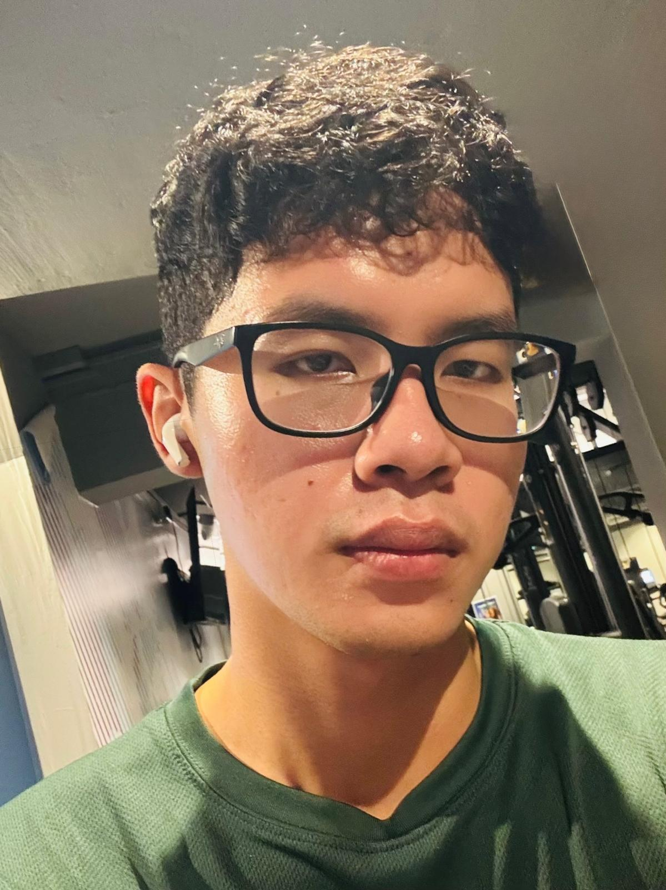
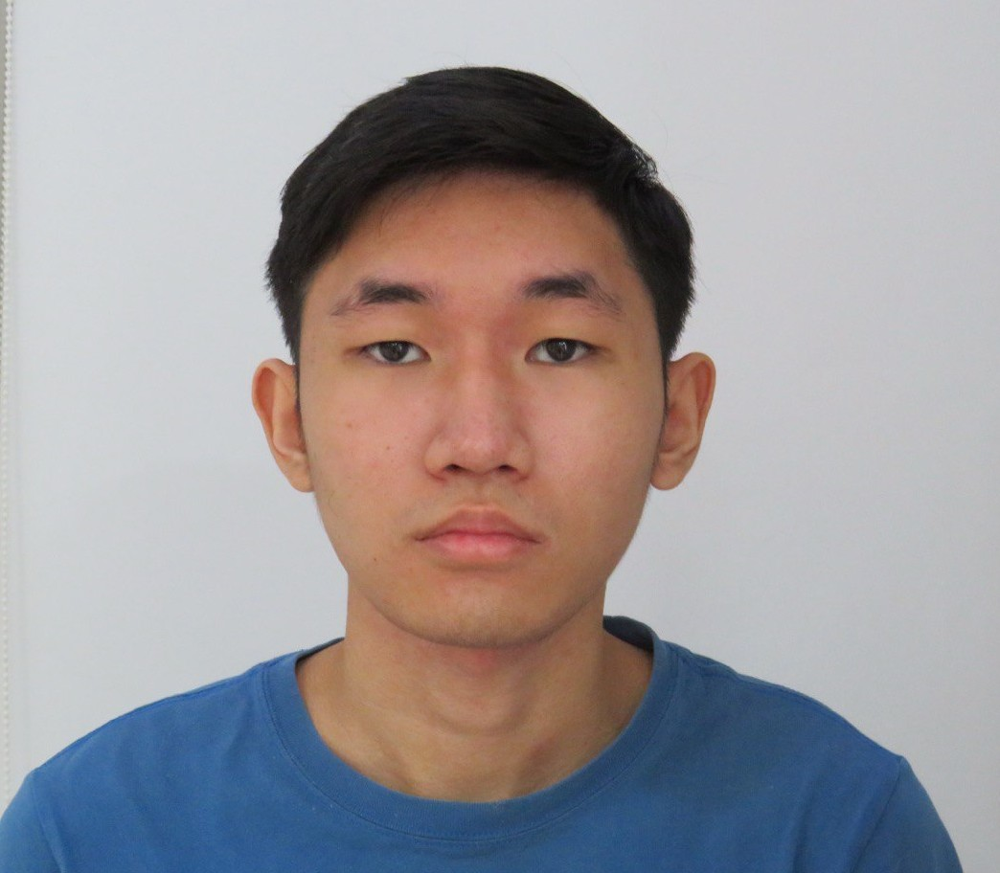

We are a team based in the [School of Computing, National University of Singapore](https://www.comp.nus.edu.sg).

You can reach us at the email `seer[at]comp.nus.edu.sg`

## Project team

### Min Wai Phyo

[[github](https://github.com/minwaiphyo)]
* Role: Code quality
* Responsibility: Looks after code quality, ensures adherence to coding standards, etc.

### Sim Ying Zhong Bryan

[[github](https://github.com/mashmllo)]
* Role: Integration
* Responsibility: In charge of versioning of the code, maintaining the code repository, integrating various parts of the software to create a whole.

### Arrick Ang

[[github](https://github.com/arrickgit)]

* Role: Developer
* Responsibilities: Dev Ops

### Daniel Qian

[[github](http://github.com/DanielQ13)]

* Role: Developer
* Responsibilities: Data

### Nicholas Kee

[[github](http://github.com/frankwotfurters)]

* Role: Developer
* Responsibilities: Backend Logic
