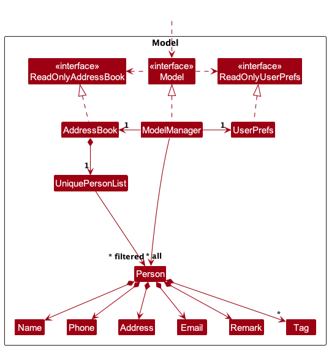
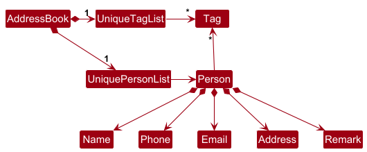
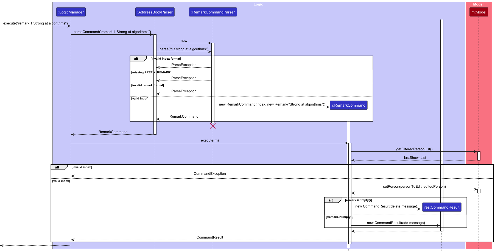
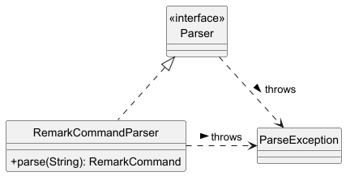
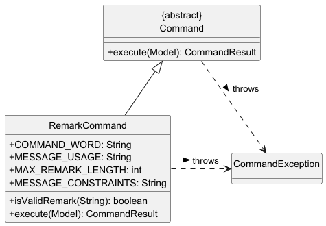

* Table of Contents
{:toc}

--------------------------------------------------------------------------------------------------------------------

## **Acknowledgements**

* No external sources were used.

--------------------------------------------------------------------------------------------------------------------

## **Setting up, getting started**

Refer to the guide [_Setting up and getting started_](SettingUp.md).

--------------------------------------------------------------------------------------------------------------------

## **Design**

:bulb: **Tip:** The `.puml` files used to create diagrams are in this document `docs/diagrams` folder. Refer to the [_PlantUML Tutorial_ at se-edu/guides](https://se-education.org/guides/tutorials/plantUml.html) to learn how to create and edit diagrams.

### Architecture

The ***Architecture Diagram*** given above explains the high-level design of the App.

Given below is a quick overview of main components and how they interact with each other.

**Main components of the architecture**

**`Main`** (consisting of classes [`Main`](https://github.com/se-edu/AY2526S2-CS2103-F09-2/tp/tree/master/src/main/java/seedu/address/Main.java) and [`MainApp`](https://github.com/se-edu/AY2526S2-CS2103-F09-2/tp/tree/master/src/main/java/seedu/address/MainApp.java)) is in charge of the app launch and shut down.
* At app launch, it initializes the other components in the correct sequence, and connects them up with each other.
* At shut down, it shuts down the other components and invokes cleanup methods where necessary.

The bulk of the app's work is done by the following four components:

* [**`UI`**](#ui-component): The UI of the App.
* [**`Logic`**](#logic-component): The command executor.
* [**`Model`**](#model-component): Holds the data of the App in memory.
* [**`Storage`**](#storage-component): Reads data from, and writes data to, the hard disk.

[**`Commons`**](#common-classes) represents a collection of classes used by multiple other components.

**How the architecture components interact with each other**

The *Sequence Diagram* below shows how the components interact with each other for the scenario where the user issues the command `delete 1`.

Each of the four main components (also shown in the diagram above),

* defines its *API* in an `interface` with the same name as the Component.
* implements its functionality using a concrete `{Component Name}Manager` class (which follows the corresponding API `interface` mentioned in the previous point.

For example, the `Logic` component defines its API in the `Logic.java` interface and implements its functionality using the `LogicManager.java` class which follows the `Logic` interface. Other components interact with a given component through its interface rather than the concrete class (reason: to prevent outside component's being coupled to the implementation of a component), as illustrated in the (partial) class diagram below.

The sections below give more details of each component.

### UI component

The **API** of this component is specified in [`Ui.java`](https://github.com/AY2526S2-CS2103-F09-2/tp/tree/master/src/main/java/seedu/address/ui/Ui.java)

The UI consists of a `MainWindow` that is made up of parts e.g.`CommandBox`, `ResultDisplay`, `PersonListPanel`, `StatusBarFooter` etc. All these, including the `MainWindow`, inherit from the abstract `UiPart` class which captures the commonalities between classes that represent parts of the visible GUI.

The `UI` component uses the JavaFx UI framework. The layout of these UI parts are defined in matching `.fxml` files that are in the `src/main/resources/view` folder. For example, the layout of the [`MainWindow`](https://github.com/AY2526S2-CS2103-F09-2/tp/tree/master/src/main/java/seedu/address/ui/MainWindow.java) is specified in [`MainWindow.fxml`](https://github.com/AY2526S2-CS2103-F09-2/tp/tree/master/src/main/resources/view/MainWindow.fxml)

The `UI` component,

* executes user commands using the `Logic` component.
* listens for changes to `Model` data so that the UI can be updated with the modified data.
* keeps a reference to the `Logic` component, because the `UI` relies on the `Logic` to execute commands.
* depends on some classes in the `Model` component, as it displays `Person` object residing in the `Model`.

### Logic component

**API** : [`Logic.java`](https://github.com/AY2526S2-CS2103-F09-2/tp/tree/master/src/main/java/seedu/address/logic/Logic.java)

Here's a (partial) class diagram of the `Logic` component:

The sequence diagram below illustrates the interactions within the `Logic` component, taking `execute("delete 1")` API call as an example.

:information_source: **Note:** The lifeline for `DeleteCommandParser` should end at the destroy marker (X) but due to a limitation of PlantUML, the lifeline continues till the end of diagram.

How the `Logic` component works:

1. When `Logic` is called upon to execute a command, it is passed to an `AddressBookParser` object which in turn creates a parser that matches the command (e.g., `DeleteCommandParser`) and uses it to parse the command.
1. This results in a `Command` object (more precisely, an object of one of its subclasses e.g., `DeleteCommand`) which is executed by the `LogicManager`.
1. The command can communicate with the `Model` when it is executed (e.g. to delete a person). 
   Note that although this is shown as a single step in the diagram above (for simplicity), in the code it can take several interactions (between the command object and the `Model`) to achieve.
1. The result of the command execution is encapsulated as a `CommandResult` object which is returned back from `Logic`.

Here are the other classes in `Logic` (omitted from the class diagram above) that are used for parsing a user command:

How the parsing works:
* When called upon to parse a user command, the `AddressBookParser` class creates an `XYZCommandParser` (`XYZ` is a placeholder for the specific command name e.g., `AddCommandParser`) which uses the other classes shown above to parse the user command and create a `XYZCommand` object (e.g., `AddCommand`) which the `AddressBookParser` returns back as a `Command` object.
* All `XYZCommandParser` classes (e.g., `AddCommandParser`, `DeleteCommandParser`, ...) inherit from the `Parser` interface so that they can be treated similarly where possible e.g, during testing.

### Model component
**API** : [`Model.java`](https://github.com/AY2526S2-CS2103-F09-2/tp/tree/master/src/main/java/seedu/address/model/Model.java)

The `Model` component,

* stores the recruiterplus data i.e., all `Person` objects (which are contained in a `UniquePersonList` object).
* stores the currently 'selected' `Person` objects (e.g., results of a search query) as a separate _filtered_ list which is exposed to outsiders as an unmodifiable `ObservableList<Person>` that can be 'observed' e.g. the UI can be bound to this list so that the UI automatically updates when the data in the list change.
* stores a `UserPref` object that represents the user’s preferences. This is exposed to the outside as a `ReadOnlyUserPref` objects.
* does not depend on any of the other three components (as the `Model` represents data entities of the domain, they should make sense on their own without depending on other components)

:information_source: **Note:** An alternative (arguably, a more OOP) model is given below. It has a `Tag` list in the `AddressBook`, which `Person` references. This allows `AddressBook` to only require one `Tag` object per unique tag, instead of each `Person` needing their own `Tag` objects. 

### Storage component

**API** : [`Storage.java`](https://github.com/AY2526S2-CS2103-F09-2/tp/tree/master/src/main/java/seedu/address/storage/Storage.java)

The `Storage` component,
* can save both recruiterplus data and user preference data in JSON format, and read them back into corresponding objects.
* inherits from both `AddressBookStorage` and `UserPrefStorage`, which means it can be treated as either one (if only the functionality of only one is needed).
* depends on some classes in the `Model` component (because the `Storage` component's job is to save/retrieve objects that belong to the `Model`)

#### Data file preprocessing and quarantine

Before reading data into model objects, the app runs `AddressBookJsonPreprocessor` to reduce startup failures caused by malformed JSON entries.

Preprocessing behavior:
* Reads the `persons` array from the configured data file.
* Classifies each entry as valid or invalid.
* Writes valid entries back to the main data file.
* Writes malformed entries to `addressbook_invalid.json` in the same directory.

Classification rules:
* Entries with all required fields and valid JSON types are treated as valid.
* Minor optional-field issues (e.g. missing `remark` or non-array `tags`) are auto-fixed.
* Non-object nodes and malformed required-field types are quarantined into `addressbook_invalid.json`.

This approach ensures malformed records are preserved for manual recovery instead of being silently dropped during rewrite.

Diagram source: `docs/diagrams/StoragePreprocessingActivity.puml`

### Common classes

Classes used by multiple components are in the `seedu.address.commons` package.

--------------------------------------------------------------------------------------------------------------------

## **Implementation**

This section describes some noteworthy details on how certain features are implemented.

### Command parameter constraints

The table below summarizes the key parameter constraints enforced by the parser and model classes.

| Command | Parameter constraints                                                                                                                                                                                                                                                                                                                                                                                                                        |
|---------|----------------------------------------------------------------------------------------------------------------------------------------------------------------------------------------------------------------------------------------------------------------------------------------------------------------------------------------------------------------------------------------------------------------------------------------------|
| `add` | Requires `-name`, `-phone`, `-email`, and `-address`. `-tag` is optional and repeatable. `Name` must contain only letters and spaces and start with a letter. `Phone` must be exactly 8 digits. `Email` must satisfy the existing email validation and be at most 100 characters. `Address` must be at most 50 characters and may contain letters, digits, spaces, commas, periods, hyphens, hashes and slashes. `Tag` must be alphanumeric. |
| `edit` | Requires a positive integer index and at least one field to edit. `-name`, `-phone`, `-email`, and `-address` follow the same constraints as `add`. `-tag` is repeatable, but it replaces the full tag set instead of appending.                                                                                                                                                                                                             |
| `delete` | Accepts one or more positive integer indexes or the keyword `all`. Duplicate indexes are rejected.                                                                                                                                                                                                                                                                                                                                           |
| `mark` | Requires a positive integer index. The target person must exist in the current filtered list and must not already be marked as interviewed.                                                                                                                                                                                                                                                                                                  |
| `unmark` | Requires a positive integer index. The target person must exist in the current filtered list and must already be marked as interviewed. The constructor also defensively rejects a null index.                                                                                                                                                                                                                                               |
| `find` | Requires at least one keyword. Search is name-only and case-insensitive; fuzzy and partial-word matching are supported.                                                                                                                                                                                                                                                                                                                      |
| `filter` | Requires exactly one `-interviewed` prefix with value `y`, `n`, `1`, or `0`. Unexpected preamble text and duplicate `-interviewed` prefixes are rejected.                                                                                                                                                                                                                                                                                    |
| `remark` | Requires a positive integer index. The remark text is optional and may be empty to clear it. Remarks are limited to 120 characters and may contain only letters, digits, spaces, and the following symbols: . , ! ? ' " ( ) - / : @ # $ % & + * = [ ] and newlines. Remarks cannot start with another command prefix such as `-name` or `-tag`.                                                                                              |
| `list`, `help`, `clear`, `exit` | No parameters are required. Extraneous arguments are ignored by design.                                                                                                                                                                                                                                                                                                                                                                      |

### Filter command hardening

The `filter` command uses `FilterCommandParser` to enforce strict input validation before a command object is created.

Validation rules:
* Exactly one `-interviewed` prefix must be present.
* The prefix value must be one of `y`, `n`, `1`, or `0`.
* Any unexpected preamble before the prefix is rejected.
* Duplicate `-interviewed` prefixes are rejected.

These checks prevent ambiguous inputs such as `filter hello -interviewed y` or `filter -interviewed y -interviewed n` from being interpreted silently.

The parser behavior is covered by `FilterCommandParserTest` to prevent regressions.

### Remark feature
The *Remark* feature allows recruiters to add, edit, or remove remarks associated with a candidate.
This is useful for storing additional qualitative notes such as interview impressions or technical strengths.

#### Implementation
The feature is implemented using `RemarkCommand` and `RemarkCommandParser`.

When the user executes a command such as:
`remark 1 Strong in algorithms`
the following steps occur:
1. The input command is received by the `LogicManager`
2. `AddressBookParser` identifies the command and delegates parsing to `RemarkCommandParser`.
3. `RemarkCommandParser` extracts and validates:
    * the target `Index`
    * the raw remark string after the index, without requiring a prefix
    * the remark string against the feature constraints
4. A `RemarkCommand` object is created
5. During execution, `RemarkCommand`:
    * retrieves the target `Person` from the filtered list in the `Model`
    * creates a new `Person` object with the updated `Remark`
    * replaces the old `Person` using `Model#setPerson()`
6. A `CommandResult` is returned and displayed to the user.

>> If the remark provided is empty, the system interprets it as a request to remove the remark.

#### Sequence Diagram

The following sequence diagram illustrates the interaction between components when executing a remark command:

#### Class structure
The remark feature also uses two supporting class diagram:

`RemarkCommandParser` implements the
generic `Parser` interface to process user input.
It validates the input and if the format or
content is incorrect,
throws `ParserException` when the  input is invalid.

`RemarkCommand` extends `Command` and encapsulates
its own feature-specific logic.
It defines constants like `MAX_REMARK_LENGTH` and
`MESSAGE_CONSTRAINTS` to enforce input rules,
and provide a validation method `isValidRemark(String)`
to ensure remarks meet those constraints
before execution.

#### Design consideration

**Aspect: How remarks are stored**

* **Current approach (chosen):** Store `Remark` as a field within `Person`
  * Pros: Simple design, consistent with existing architecture
  * Cons: Requires creating a new `Person` object for each update

* **Alternative:** Store remarks separately from `Person`
  * Pros: Avoids recreating `Person`
  * Cons: Adds complexity and weakens encapsulation

--------------------------------------------------------------------------------------------------------------------

## **Documentation, logging, testing, configuration, dev-ops**

* [Documentation guide](Documentation.md)
* [Testing guide](Testing.md)
* [Logging guide](Logging.md)
* [Configuration guide](Configuration.md)
* [DevOps guide](DevOps.md)

--------------------------------------------------------------------------------------------------------------------

## **Appendix: Requirements**

### Product scope

**Target user profile**:

* is an in-house technical recruiter at Singapore tech company or startup
* manages multiple engineering candidates across multiple job openings at any time
* needs to quickly access and update candidate profiles during hiring discussions
* prefer desktop apps over other types
* can type fast
* prefers typing to mouse interactions
* is reasonably comfortable using CLI apps

**Value proposition**: Streamline engineering hiring by providing tools to optimize the tracking of candidates' skills
and interview progress, enabling recruiters to quickly find and manage technical talents efficiently.

### User stories

Priorities: High (must have) - `* * *`, Medium (nice to have) - `* *`, Low (unlikely to have) - `*`

| Priority | As a …​                | I want to …​                                          | So that I can…​                                                        |
| ----- |------------------------|-------------------------------------------------------|------------------------------------------------------------------------|
| `* * *` | technical recuiter | mark candidate as interviewed                         | mark candidates who have been interviewed                              |
| `* * *` | forgetful technical recuiter | see usage instructions                                | refer to instructions when I forget how to use the App                 |
| `* * *` | technical recuiter          | add a new person                                      |                                                                        |
| `* * *` | technical recuiter          | delete a person                                       | remove entries that I no longer need                                   |
| `* * *` | technical recuiter          | find a person by name                                 | locate details of persons without having to go through the entire list |
| `* *` | technical recuiter          | filter candidates by interview status                 | see which interviewees have not been interviewed                       |
| `* *`   | technical recuiter          | search candidates by skills                           | save time performing repetitive tasks                                  |
| `* *`  | technical recuiter      | search candidates using keywords or technical skills  | locate relevant contacts                                               |
| `* *`   | technical recuiter      | unmark candidate as interviewed                       | correct candidates who were wrongly marked as interviewed              |
| `*`   | technical recuiter      | filter candidates by multiple criteria simultaneously | quickly identify candidates ready for the next step                    |

### Use cases

(For all use cases below, the **System** is the `RecruiterPlus` and the **Actor** is the `recruiter`, unless specified otherwise)

**Use case: Add a candidate**

**MSS**

1. User requests to add a candidate with name, phone, and email.
2. RecruiterPlus validates the input parameters.
3. RecruiterPlus checks that the candidate is not a duplicate by name (case-insensitive).
4. RecruiterPlus saves the candidate details (with interviewed set to unmarked by default).
5. RecruiterPlus updates the GUI to show the newly added candidate and increments the candidate count.
6. RecruiterPlus shows a success message.

Use case ends.

**Extensions**

* 2a. Missing required parameter(s).
   * 2a1. RecruiterPlus shows the relevant error message:
      * Missing Required Parameter: -name
      * Missing required parameter: -phone
      * Missing required parameter: -email

   Use case ends.

* 2b. Parameter specified more than once.
   * 2b1. RecruiterPlus shows the relevant error message:
      * Parameter -name specified more than once
      * Parameter -phone specified more than once
      * Parameter -email specified more than once

   Use case ends.

* 2c. Invalid/empty name (after trimming; includes "only spaces").
  * 2c1. RecruiterPlus shows:
    * Names should only contain English letters (A-Z, a-z) and spaces, and it should not be blank. No digits or 
      special characters are allowed.

  Use case ends.

* 2d. Invalid phone number.
  * 2d1.RecruiterPlus shows:
    * Phone numbers must contain exactly 8 digits (0-9). No spaces, dashes, or other characters are allowed.

   Use case ends.

* 2e. Invalid email.
   * 2e1. RecruiterPlus shows:
      * Invalid email: must be a valid email address (e.g. name@example.com) with no spaces.

   Use case ends.

* 2f. Input too long / parser overflow.
    * 2f1. RecruiterPlus shows:
        * Error: Input too long. Name must be at most 80 characters; email at most 254 characters.

  Use case ends.

* 3a. Candidate is a duplicate by name (case-insensitive).
  * 3a1. RecuiterPlus shows:
    * This person already exists in the address book

   Use case ends.

* 4a. Storage is full and saving fails.
   * 4a1. RecruiterPlus shows:
      * Error: Could not save data, Please try again.

   Use case ends.

* 4b. Data file is corrupted and prevents saving.
   * 4b1. RecruiterPlus shows:
      * Error: Data file is corrupted. Restore from backup or reset data.

   Use case ends.

**Use case: View candidates**

**MSS**

1. User requests to list candidates using `list`.
2. RecruiterPlus shows a list of all candidates.

Use case ends.

**Extensions**

* 2a. The list is empty.
   * 2a1. RecruiterPlus shows "No candidates saved!".

   Use case ends.

**Use case: Delete a candidate**

**MSS**

1. User requests to list candidates.
2. RecruiterPlus shows a list of candidates.
3. User requests to delete a specific candidate in the list using `delete <id>`.
4. RecruiterPlus deletes the candidate.
5. RecruiterPlus updates the GUI and shows a success message.

Use case ends.

**Extends:** Use case: View candidates, 2a (list is empty)

**Extensions**

* 2a. The list is empty.
   * 2a1. RecruiterPlus shows "No candidates saved!".

   Use case ends.

* 3a. Invalid format.
   * 3a1. RecruiterPlus shows: ERROR: Invalid format! Usage: delete <id>

   Use case ends.

* 3b. Invalid ID (not a non-negative integer).
   * 3b1. RecruiterPlus shows: ERROR: Invalid ID. Ensure ID is a non-negative integer

   Use case ends.

* 4a. ID not found.
   * 4a1. RecruiterPlus shows: ERROR: ID not found

   Use case resumes at step 2.

**Use case: Mark a candidate as interviewed**

**MSS**

1. User requests to list candidates.
2. RecruiterPlus shows a list of candidates.
3. User requests to mark a specific candidate in the list using `mark <id>`.
4. RecruiterPlus marks the candidate as interviewed.
5. RecruiterPlus updates the GUI and shows a success message.

Use case ends.

**Extends:** Use case: View candidates, 2a (list is empty)

**Extensions**

* 2a. The list is empty.
   * 2a1. RecruiterPlus shows "No candidates saved!".

   Use case ends.

* 3a. Invalid format.
   * 3a1. RecruiterPlus shows: ERROR: Invalid format! Usage: mark <id>

   Use case ends.

* 3b. Invalid ID (not a non-negative integer).
   * 3b1. RecruiterPlus shows: ERROR: Invalid ID. Ensure ID is a non-negative integer

   Use case ends.

* 4a. ID not found.
   * 4a1. RecruiterPlus shows: ERROR: ID not found

   Use case resumes at step 2.

**Use case: Add a remark to a candidate**

**MSS**

1. User requests to list candidates.
2. RecruiterPlus shows a list of candidates.
3. User requests to add a remark to a specific candidate using `remark <id> <remark>`.
4. RecruiterPlus updates the candidate's remark.
5. RecruiterPlus updates the GUI and shows a success message.

Use case ends.

**Extends:** Use case: View candidates, 2a (list is empty)

**Extensions**

* 2a. The list is empty.
    * 2a1. RecruiterPlus shows "No candidates saved!".

  Use case ends.

* 3a. Invalid format.
   * 3a1. RecruiterPlus shows: ERROR: Invalid format! Usage: remark <id> <remark>

  Use case ends.

* 3b. Invalid ID (not a non-negative integer).
    * 3b1. RecruiterPlus shows: ERROR: Invalid ID. Ensure ID is a non-negative integer

  Use case ends.

* 4a. ID not found.
    * 4a1. RecruiterPlus shows: ERROR: ID not found

  Use case resumes at step 2.

### Non-Functional Requirements

1.  Should work on any _mainstream OS_ as long as it has Java `17` or above installed.
2.  Should be able to hold up to 1000 persons without a noticeable sluggishness in performance for typical usage.
3.  A user with above average typing speed for regular English text (i.e. not code, not system admin commands) should be able to accomplish most of the tasks faster using commands than using the mouse.

### Glossary

* **Mainstream OS**: Windows, Linux, Unix, MacOS
* **Private contact detail**: A contact detail that is not meant to be shared with others
* **Candidate**: An engineering job applicant whose details are tracked in RecruiterPlus, including their technical skills, interview progress, and availability.
* **Interview Status/Stage**: The current position of a candidate in the hiring pipeline (e.g., Phone Screen, Technical Interview, Offer Extended, Rejected).
* **Technical Skills**: Programming languages, frameworks, tools, or domain expertise that candidates possess (e.g., Python, React, Machine Learning, Kubernetes).
* **CLI (Command Line Interface)**: A text-based interface where users interact with the application by typing commands rather than using a mouse.

--------------------------------------------------------------------------------------------------------------------

## **Appendix: Instructions for manual testing**

Given below are instructions to test the app manually.

:information_source: **Note:** These instructions only provide a starting point for testers to work on;
testers are expected to do more *exploratory* testing.

### Launch and shutdown

1. Initial launch

   1. Download the jar file and copy into an empty folder

   1. Double-click the jar file.  
   Expected: Shows the GUI with a set of sample contacts. The initial window size and position may not be optimal.

1. Saving window preferences

   1. Resize the window to an optimum size. Move the window to a different location. Close the window.

   1. Re-launch the app by double-clicking the jar file. 
       Expected: The most recent window size and location is retained.

1. Shutdown using the `exit` or `bye` command

    1. Launch the app.
   
    1. Execute `exit` or `bye`. 
   Expected: The application closes successfully.

### Deleting a person

1. Deleting a person while all persons are being shown

   1. Prerequisites: List all persons using the `list` command. Multiple persons in the list.

   1. Test case: `delete 1` 
      Expected: First contact is deleted from the list. Details of the deleted contact shown in the status message. Timestamp in the status bar is updated.

   1. Test case: `delete 1 3` 
      Expected: The 1st and 3rd displayed candidates are deleted in one command.The result message lists both deletions.

   1. Test case: `find Alex` followed by `delete all` 
      Expected: All currently displayed candidates in the filtered list are deleted.
      Candidates outside the filtered list remain untouched.

   1. Test case: `delete 0` 
      Expected: No person is deleted. Error details shown in the status message. Status bar remains the same.

   1. Other incorrect delete commands to try: `delete`, `delete x`, `...` (where x is larger than the list size) 
      Expected: Similar to previous.

### Saving data

1. Data is saved automatically after modifying commands

    1. Launch the app and execute `delete 1`.
   
    1. Close the app and launch it again. 
   Expected: The deletion persists after restart.

1. Missing data files

   1. Close the app.

   1. Delete `data/addressbook.json` from the app's home folder.

   1. Launch the app. 
   Expected: The app starts successfully with sample data.

1. Corrupted data file with some invalid entries

    1. Close the app.

    1. Edit `data/addressbook.json` so that one valid candidate entry remains valid,
     and another entry contains an invalid field value
     or is missing a required field.  

    1. Launch the app. 
       Expected: The app starts successfully. Valid entries remain in the main data file.
       Invalid entries are quarantined into `data/addressbook_invalid.json` 

1. Severely malformed data file

    1. Close the app.

    1. Replace the contents of `data/addressbook.json` with clearly malformed JSON, for example `this is not JSON`.

    1. Launch the app. 
       Expected: The app starts successfully. If recovery is not possible,
       the displayed list is empty and the malformed content is not loaded.

### Marking a candidate as interviewed

1. Marking a candidate while all candidates are being shown

    1. Prerequisites: List all candidates using the `list` command. Multiple candidates in the list.

    1. Test case: `mark 1` 
       Expected: First candidate is marked as interviewed. Success message shown in the status message.

    1. Test case: `mark 1` again 
       Expected: No change is made. An error message indicates that
       the candidate has already been marked as interviewed.

    1. Test case: `mark 0` 
       Expected: No candidate is marked. An error message is shown.

   1. Test case: `mark 999` when fewer than 999 candidates are shown 
      Expected: No candidate is marked. An error message is shown.

### Unmarking a candidate as not interviewed

1. Unmarking a candidate while all candidates are being shown

    1. Prerequisites: List all candidates using the `list` command. Multiple candidates in the list.
    Execute `mark 1` so that the first candidate is already marked as interviewed.

    1. Test case: `unmark 1` 
       Expected: First candidate is marked as not interviewed. Success message shown in the status message.

    1. Test case: `unmark 1` again 
       Expected: No change is made. An error message indicates that
      the candidate has already been marked as not interviewed.

    1. Test case: `unmark 0` 
       Expected: No candidate is unmarked. An error message is shown.

### Adding a remark to a candidate

1. Adding a remark while all candidates are being shown

    1. Prerequisites: List all candidates using the `list` command. Multiple candidates in the list.

    1. Test case: `remark 1 Strong in algorithms.` 
       Expected: Remark added to first candidate. Success message shown in the status message.

   1. Test case: `remark 1 Updated strong in Simulations.` 
      Expected: Remark replaced with the new remark. Success message shown in the status message.

    1. Test case: `remark 1` 
       Expected: Remark removed from first candidate. Success message shown in the status message.

    1. Test case: `remark 0 test` 
       Expected: No remark added. Error details shown in the status message.

   1. Test case: `remark 999` when fewer than 999 candidates are shown 
      Expected: No remark added. Error details shown in the status message.

### Finding candidates by name

1. Finding candidates while all candidates are being shown

    1. Prerequisites: List all candidates using the `list` command. Multiple candidates in the list, with at least 
       some distinct names.

   1. Test case: `find alex` 
      Expected: All candidates whose names match `Alex` are shown.
      A success message indicates how many candidates were found.

   1. Test case: `find alex` 
      Expected: Same result as `find Alex`, since search is case-insensitive.

   1. Test case: `find alex david` 
      Expected: Candidates whose names match either `alex` or `david` are shown.

   1. Test case: `find  aled` 
      Expected: Candidates with close name matches such as `Alex` may be shown, since fuzzy matching is supported.

   1. Test case: `find  Al` 
      Expected: Candidates whose names partially match `Al` are shown. Depending on the candidate list,
     this may return more results than expected because partial matching is supported.

   1. Test case: `find  zzzzzz` 
      Expected: No candidates are shown. A success message indicates that 0 candidates were found.

   1. Test case: `find Alex` followed by `delete 1` 
      Expected: Only the first candidate in the filtered results is deleted.
     Candidates outside the filtered list are unaffected.

   1. Test case: `find` 
      Expected: No search is performed. An error message is shown.
