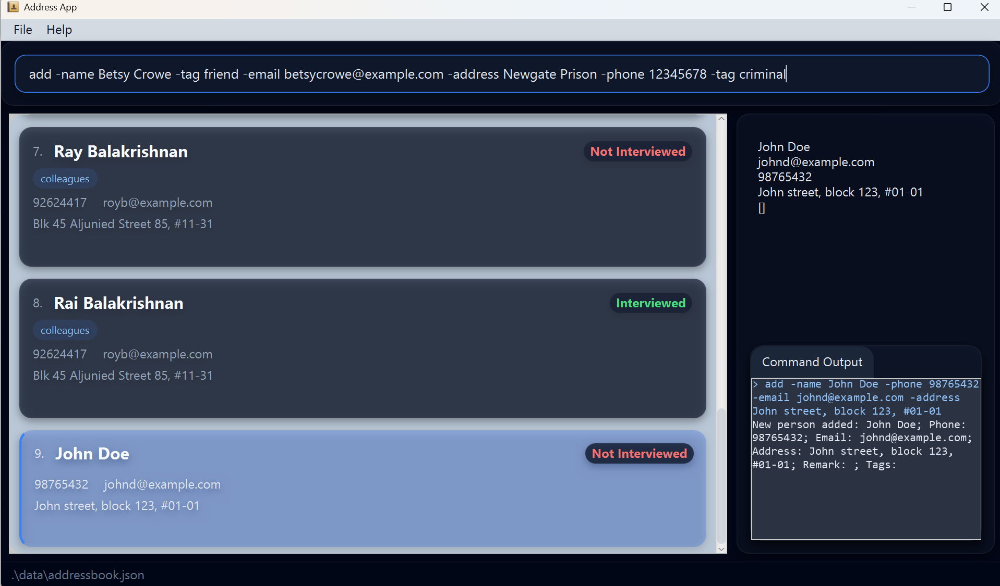
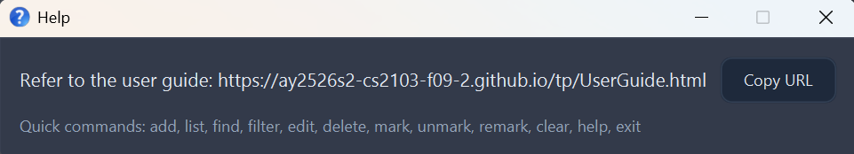
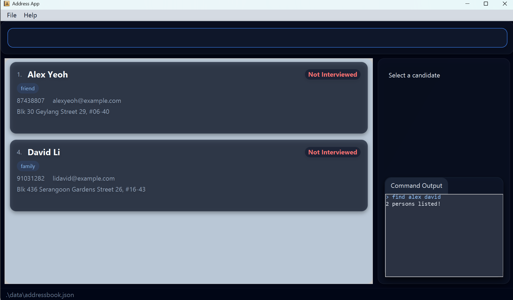
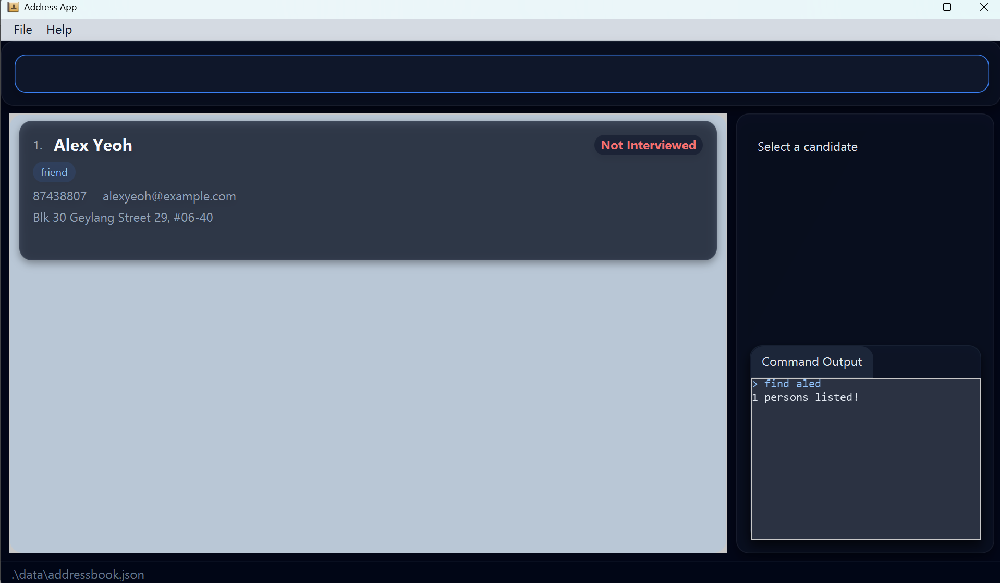

RecruiterPlus is a **desktop app for managing contacts, optimized for use via a Command Line Interface** (CLI) while still having the benefits of a Graphical User Interface (GUI). If you can type fast, RecruiterPlus can get your contact management tasks done faster than traditional GUI apps.

* Table of Contents
{:toc}

--------------------------------------------------------------------------------------------------------------------

## Quick start

1. Ensure you have Java `17` or above installed in your Computer. 
   **Mac users:** Ensure you have the precise JDK version prescribed [here](https://se-education.org/guides/tutorials/javaInstallationMac.html).

2. Download the latest `.jar` file from [here](https://github.com/AY2526S2-CS2103-F09-2/tp/releases).

3. Copy the file to the folder you want to use as the _home folder_ for your RecruiterPlus.

4. Open a command terminal, `cd` into the folder you put the jar file in, and use the `java -jar recruiterplus.jar` command to run the application. 
   A GUI similar to the below should appear in a few seconds. Note how the app contains some sample data. 
   

5. Type the command in the command box and press Enter to execute it. e.g. typing **`help`** and pressing Enter will display the command reference in the command output. 
   Some example commands you can try:

   * `list` : Lists all contacts.

   * `add -name John Doe -phone 98765432 -email johnd@example.com -address John street, block 123, #01-01` : Adds a contact named `John Doe` to the RecruiterPlus.

   * `delete 3` : Deletes the 3rd contact shown in the current list.

   * `clear` : Deletes all contacts.

   * `exit` : Exits the app.

6. Refer to the [Features](#features) below for details of each command.

--------------------------------------------------------------------------------------------------------------------

## Features

**:information_source: Notes about the command format:** 

* Words in `UPPER_CASE` are the parameters to be supplied by the user. 
  e.g. in `add -name NAME`, `NAME` is a parameter which can be used as `add -name John Doe`.

* Items in square brackets are optional. 
  e.g. `-name NAME [-tag TAG]` can be used as `-name John Doe -tag friend` or as `-name John Doe`.

* Items with `…`​ after them can be used multiple times including zero times. 
  e.g. `[-tag TAG]…​` can be used as ` ` (i.e. 0 times), `-tag friend`, `-tag friend -tag family` etc.

* Parameters can be in any order. 
  e.g. if the command specifies `-name NAME -phone PHONE_NUMBER`, `-phone PHONE_NUMBER -name NAME` is also acceptable.

* Extraneous parameters for commands that do not take in parameters (such as `help`, `list`, `exit` and `clear`) will be ignored. 
  e.g. if the command specifies `help 123`, it will be interpreted as `help`.

* If you are using a PDF version of this document, be careful when copying and pasting commands that span multiple lines as space characters surrounding line-breaks may be omitted when copied over to the application.

### Viewing help : `help`

Shows a message explaining how to access the help page.

Format: `help`

### Adding a person: `add`

Adds a person to the recruiterplus.

Format: `add -name NAME -phone PHONE_NUMBER -email EMAIL -address ADDRESS -tag TAG…​`
* At least the `-name`, `-phone`, `-email` and `-address` fields must be provided.
* The `-tag` field is optional.
* The `-tag` field can be used multiple times to add multiple tags to a person. Eg: `-tag friend -tag colleague` adds the tags `friend` and `colleague` to the person.

:bulb: **Tip:**
A person can have any number of tags (including 0)

Examples:
* `add -name John Doe -phone 98765432 -email johnd@example.com -address John street, block 123, #01-01`
* `add -name Betsy Crowe -tag friend -email betsycrowe@example.com -address Newgate Prison -phone 12345678 -tag criminal`
* `add -name Bo Yang -phone 87654321 -email boyang@example.com -address Bo's street, block 321, #01-02 -tag colleague -tag friend` to add multiple tags, use -tag [TAG] multiple times.

### Listing all persons : `list`

Shows a list of all persons in the recruiterplus.

Format: `list`

### Editing a person : `edit`

Edits an existing person in the recruiterplus.

Format: `edit INDEX [-name NAME] [-phone PHONE] [-email EMAIL] [-address ADDRESS] [-tag TAG]…​`

* Edits the person at the specified `INDEX`. The index refers to the index number shown in the displayed person list. The index **must be a positive integer** 1, 2, 3, …​
* At least one of the optional fields must be provided.
* Existing values will be updated to the input values.
* When editing tags, the existing tags of the person will be removed i.e adding of tags is not cumulative.
* You can remove all the person’s tags by typing `-tag ` without specifying any tags after it.
* You can add multiple tags by using `-tag [TAG]` multiple times.

Examples:
*  `edit 1 -phone 91234567 -email johndoe@example.com` Edits the phone number and email address of the 1st person to be `91234567` and `johndoe@example.com` respectively.
*  `edit 2 -name Betsy Crower -tag` Edits the name of the 2nd person to be `Betsy Crower` and clears all existing tags.
*  `edit 3 -tag friend -tag colleague` Edits the tags of the 3rd person to be `friend` and `colleague`.

### Locating persons by name: `find`

Finds persons whose names contain any of the given keywords.

Format: `find KEYWORD [MORE_KEYWORDS]`

* The search is case-insensitive. e.g. `hans` will match `Hans`
* The search supports typos via fuzzy matching. e.g. `Alicd` will match `Alice`
* The order of the keywords does not matter. e.g. `Hans Bo` will match `Bo Hans`
* Only the name is searched.
* Partial word matching is supported e.g. `Han` will match `Hans`
* Persons matching at least one keyword will be returned (i.e. `OR` search).
  e.g. `Hans Bo` will return `Hans Gruber`, `Bo Yang`

Examples:
* `find John` returns `john` and `John Doe`
* `find alex david` returns `Alex Yeoh`, `David Li` 
  
* `find aled` returns `Alex Yeoh`  

### Filtering persons by name: `filter`

Finds persons whose names match any of the given filters.

Format: `filter -interviewed y/n/1/0`

* The filter will be done on all persons, not only the currently listed ones.

Examples:
* `filter -interviewed y` returns persons who are marked as interviewed.
* `filter -interviewed 0` returns persons who are <u>not</u> marked as interviewed.
  

### Deleting a person : `delete`

Deletes the specified person(s) from the recruiterplus.

Format: `delete INDEX [MORE_INDEXES]... | all`

* Deletes the person(s) at the specified `INDEX`.
* The index refers to the index number shown in the displayed person list.
* The index **must be a positive integer** 1, 2, 3, …​
* Multiple indexes can be specified to delete several candidates at once.
* Duplicate indexes are not allowed.
* Use `all` to delete all currently displayed candidates.
* `delete all` on an empty list will show an error message.

Examples:
* `delete 2` deletes the 2nd person in the recruiterplus.
* `delete 1 3 5` deletes the 1st, 3rd and 5th persons in the displayed list.
* `find Betsy` followed by `delete all` deletes all persons in the results of the `find` command.

### Marking a candidate as interviewed : `mark`

Marks the specified candidate as interviewed.

Format: `mark INDEX`

* Marks the candidate at the specified `INDEX` as interviewed.
* The index refers to the index number shown in the displayed person list.
* The index **must be a positive integer** 1, 2, 3, …​
* A candidate that has already been marked as interviewed cannot be marked again.

Examples:
* `mark 1` marks the 1st candidate in the list as interviewed.
* `find John` followed by `mark 1` marks the 1st candidate in the results of the `find` command as interviewed.

### Unmarking a candidate as not interviewed : `unmark`

Unmarks the specified candidate as interviewed.

Format: `unmark INDEX`

* Unmarks the candidate at the specified `INDEX` as not interviewed.
* The index refers to the index number shown in the displayed person list.
* The index **must be a positive integer** 1, 2, 3, …​
* A candidate that is already marked as not interviewed cannot be unmarked again.

Examples:
* `unmark 1` unmarks the 1st candidate in the list as not interviewed.
* `find John` followed by `unmark 1` unmarks the 1st candidate in the results of the `find` command as not interviewed.

### Adding a remark to a candidate : `remark`

Adds or edits a remark for the specified candidate.

Format: `remark INDEX [REMARK]`

* Adds or edits the remark of the candidate at the specified `INDEX`.
* The index refers to the index number shown in the displayed person list.
* The index **must be a positive integer** 1, 2, 3, …​
* An existing remark will be overwritten by the new remark.

Examples:
* `remark 1 Strong in algorithms.` adds the remark "Strong in algorithms." to the 1st candidate.
* `remark 1` clears the remark of the 1st candidate.

### Clearing all entries : `clear`

Clears all entries from the recruiterplus.

Format: `clear`

### Exiting the program : `exit`

Exits the program and closes the application.

Format: `exit`

Alias: `bye`

### Saving the data

RecruiterPlus data are saved in the hard disk automatically after any command that changes the data. There is no need to save manually.

### Editing the data file

RecruiterPlus data are saved automatically as a JSON file `[JAR file location]/data/recruiterplus.json`. Advanced users are welcome to update data directly by editing that data file.

:exclamation: **Caution:**
Malformed entries are quarantined into `addressbook_invalid.json` during startup preprocessing, while valid entries are kept in the main data file. This helps prevent silent data loss when only some records are invalid. 
However, if the overall file is severely corrupted or contains values that violate model constraints, the app may still fail to load some entries. It is recommended to keep a backup before editing the data file manually.

### Archiving data files `[coming in v2.0]`

_Details coming soon ..._

--------------------------------------------------------------------------------------------------------------------

## FAQ

**Q**: How do I transfer my data to another Computer? 
**A**: Install the app in the other computer and overwrite the empty data file it creates with the file that contains the data of your previous RecruiterPlus home folder.

--------------------------------------------------------------------------------------------------------------------

## Known issues

1. **When using multiple screens**, if you move the application to a secondary screen, and later switch to using only the primary screen, the GUI will open off-screen. The remedy is to delete the `preferences.json` file created by the application before running the application again.
2. **If you minimize the Help Window** and then run the `help` command (or use the `Help` menu, or the keyboard shortcut `F1`) again, the original Help Window will remain minimized, and no new Help Window will appear. The remedy is to manually restore the minimized Help Window.

--------------------------------------------------------------------------------------------------------------------

## Command summary

Action | Format, Examples
--------|------------------
**Add** | `add -name NAME -phone PHONE_NUMBER -email EMAIL -address ADDRESS [-tag TAG]…​`   e.g., `add -name James Ho -phone 22224444 -email jamesho@example.com -address 123, Clementi Rd, 1234665 -tag friend -tag colleague`
**Clear** | `clear`
**Delete** | `delete INDEX`  e.g., `delete 3`
**Edit** | `edit INDEX [-name NAME] [-phone PHONE_NUMBER] [-email EMAIL] [-address ADDRESS] [-tag TAG]…​`  e.g.,`edit 2 -name James Lee -email jameslee@example.com`
**Find** | `find KEYWORD [MORE_KEYWORDS]`  e.g., `find James Jake`
**Mark** | `mark INDEX`  e.g., `mark 1`
**Unmark** | `unmark INDEX`  e.g., `unmark 1`
**Remark** | `remark INDEX [REMARK]`  e.g., `remark 1 Strong in algorithms.`
**List** | `list`
**Help** | `help`
